# TakaPilot System Documentation

Last updated: 2026-05-22

TakaPilot is a subscription-based personal finance manager built with Next.js App Router, React, Prisma, PostgreSQL, NextAuth, server actions, browser push notifications, and a bilingual Bangla/English interface. The system covers daily finance tracking, budgets, goals, investments, salary and tax planning, service subscriptions, support workflows, admin operations, analytics, and manual local payment verification.

## System At A Glance

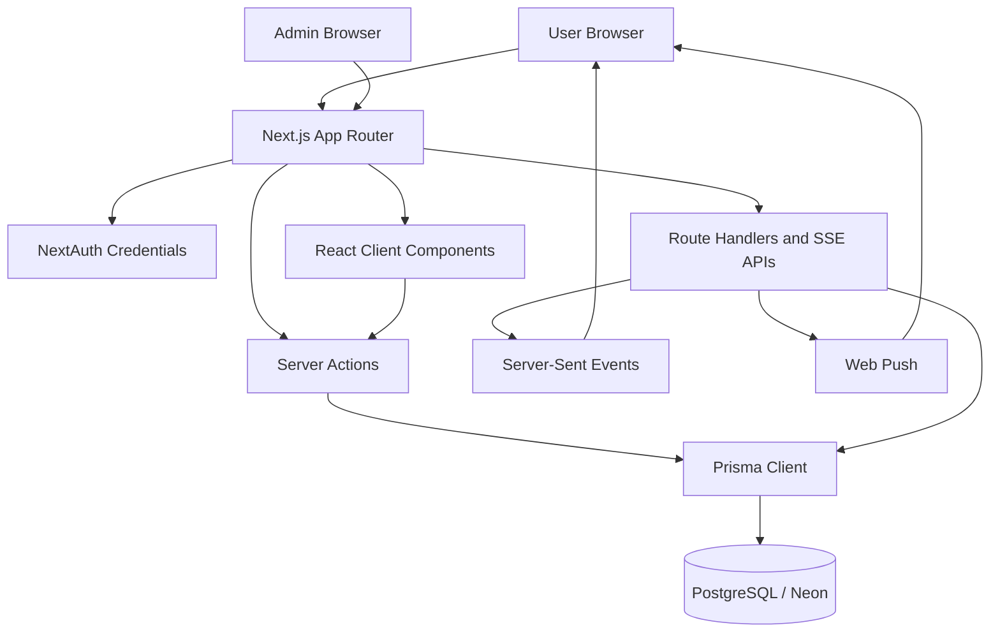

## Technology Stack

| Layer | Current implementation |
| --- | --- |
| Framework | Next.js 16 App Router |
| UI | React 19, Tailwind CSS, lucide-react, Recharts |
| Auth | NextAuth credentials provider with Prisma-backed user records |
| Data | PostgreSQL via Prisma Client |
| Validation | Zod schemas under `src/lib/validations` |
| Business logic | Server actions in `src/actions`, domain services in `src/services` |
| Notifications | In-app notifications, SSE events, service worker browser push |
| Payments | Manual bKash/Nagad style payment submission and admin approval |
| Localization | Bangla default with English support |
| Currency default | BDT |

## Request And Runtime Flow

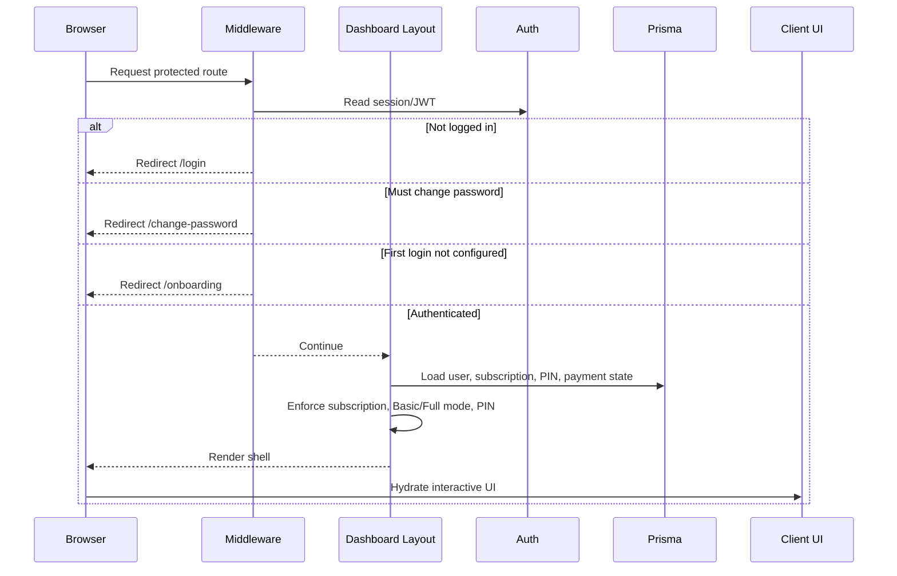

## Application Structure

```text
src/
  app/                  Route tree, layouts, pages, API route handlers
  actions/              Server actions called by UI forms and buttons
  services/             Domain query/mutation logic shared by pages/actions
  components/           Client and server UI components
  lib/                  Cross-cutting helpers: auth, access, Prisma, PIN, utils
  i18n/                 Locale config and Bangla/English messages
  types/                Shared TypeScript and NextAuth session types
prisma/
  schema.prisma         Database schema
  migrations/           Deployed migration history
public/
  takapilot-sw.js       Browser push service worker
```

## Main Product Modules

| Module | Routes | Core files | Purpose |
| --- | --- | --- | --- |
| Authentication | `/login`, `/register`, `/change-password`, `/onboarding` | `auth.actions.ts`, `auth.ts`, `auth.config.ts` | Login, registration, first setup, mandatory password change |
| Dashboard | `/dashboard` | `dashboard/page.tsx`, dashboard components | Financial summary, charts, recent transactions, portfolio widgets |
| Accounts | `/accounts` | `account.actions.ts`, `account.service.ts` | Cash, bank, credit, mobile banking, savings, investment accounts |
| Transactions | `/transactions` | `transaction.actions.ts`, `transaction.service.ts` | Income/expense tracking with filters and categories |
| Categories | `/categories` | `category.actions.ts`, `category.service.ts` | Default and custom income/expense classification |
| Budgets | `/budgets` | `budget.actions.ts`, `budget.service.ts` | Monthly limits, rollover, usage reporting |
| Goals | `/goals` | `goal.actions.ts`, `goal.service.ts` | Savings goals and goal funding/take history |
| Reports | `/reports` | `report.service.ts`, `ReportsPageClient.tsx` | Trends, category breakdowns, date-range reports |
| Recurring | `/recurring` | `recurring.actions.ts`, `recurring.service.ts` | App-triggered recurring transaction processing |
| Investments | `/investments`, `/investments/portfolio`, `/investments/types` | `investment.actions.ts`, `investment.service.ts` | Portfolio, returns, cashflows, valuations, maturity tracking |
| Salary Planner | `/salary-planner` | `salary-calculator.ts`, `salary-planner.actions.ts` | Bangladesh salary and tax planning |
| Tax Calculator | `/tax-calculator` | `TaxCalculatorClient.tsx`, `tax-config.service.ts` | Taxable income, slab tax, rebate planning |
| Service Tracker | `/service-tracker` | `personal-subscription.actions.ts` | User-owned subscriptions and auto-payment reminders |
| Notes | `/notes` | `financial-note.actions.ts`, `financial-note.service.ts` | Financial notes, receivables, asset/money records |
| Support | `/support`, `/support/[id]` | `support.actions.ts`, `support.service.ts` | Tickets, messages, support PIN, read-only support view |
| Settings | `/settings` | `settings.actions.ts`, `SettingsPageClient.tsx` | Profile, locale, currency, app PIN, data reset, account deletion |
| Admin | `/admin/*` | `admin.actions.ts`, admin clients | Users, subscriptions, payments, messages, analytics, tax config |

## Access Control

TakaPilot uses several layers of access control. The important part is that no single UI check is trusted as the only guard.

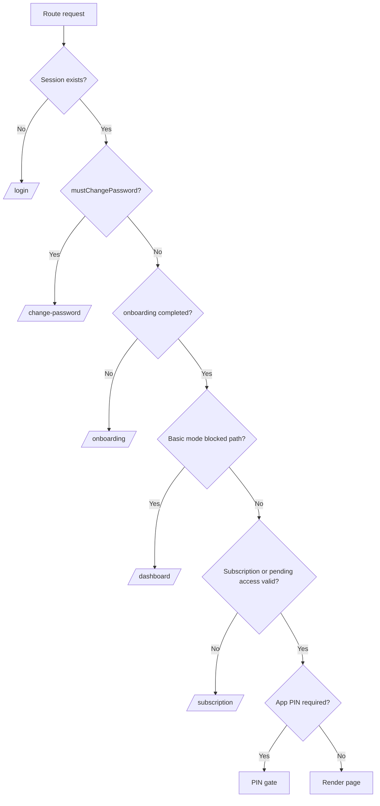

### Role And Feature Access

- `ADMIN` can access admin routes and has subscription access by role.
- `USER` access depends on subscription, payment grace state, trial, and feature permissions.
- Workspace collaboration is modeled with `SharedAccess` and per-feature `FeatureAccess`.
- Basic mode hides and blocks advanced modules such as goals, investments, salary planner, tax calculator, recurring, service tracker, and notes.

## First Login Onboarding

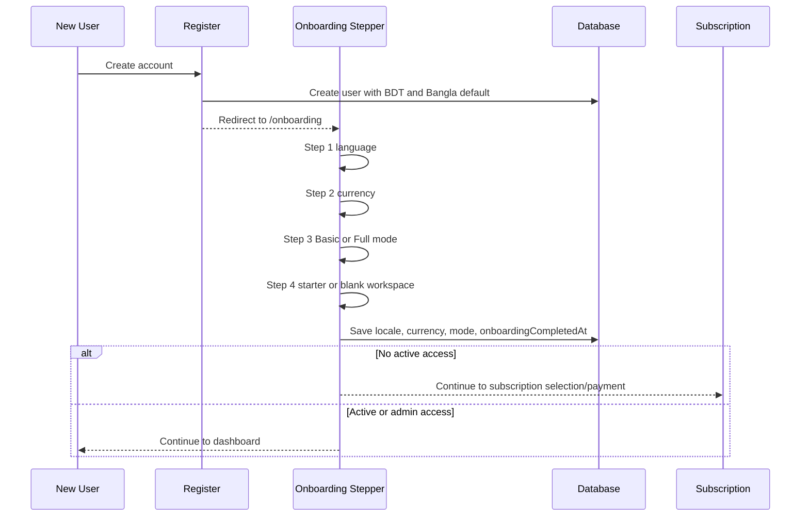

Onboarding is implemented in:

- `src/app/onboarding/page.tsx`
- `src/components/onboarding/OnboardingClient.tsx`
- `src/actions/onboarding.actions.ts`
- `src/lib/experience-mode.ts`

## Subscription And Payment Flow

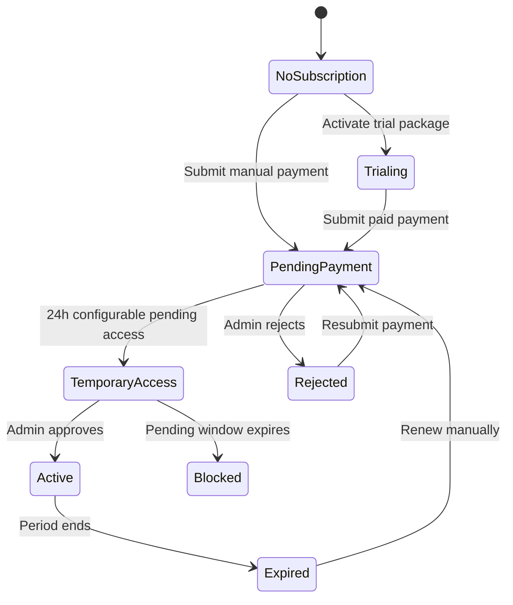

Key entities:

- `SubscriptionPackage`
- `UserSubscription`
- `ManualPaymentMethod`
- `ManualPaymentRequest`

Important behavior:

- Trial packages are admin-defined and selectable once.
- Trial packages do not require payment.
- Paid packages use manual payment submission.
- After payment submission, the user can receive temporary access during the admin verification window.
- Admin approval activates the selected package.

## Notification System

```mermaid
flowchart LR
  Detector[Notification detectors] --> Notification[(Notification)]
  AdminMessage[Admin messages] --> Notification
  Notification --> Bell[Topbar bell]
  Notification --> SSE[/api/notifications/events]
  AdminMessage --> PushQueue[Browser push trigger]
  PushQueue --> ServiceWorker[takapilot-sw.js]
  ServiceWorker --> BrowserNotification[Browser notification]
  UserPrefs[NotificationPreference] --> Detector
```

Notification channels:

- In-app notification feed and unread count.
- SSE for live updates while the app is open.
- Browser push subscriptions for notification delivery outside the active tab, depending on browser permission and service worker support.
- Admin messages can display as modal, banner, both, or push-only.

Important files:

- `src/services/notification.service.ts`
- `src/services/notification-detector.service.ts`
- `src/actions/notification.actions.ts`
- `src/actions/browser-push.actions.ts`
- `src/components/messages/BrowserNotificationManager.tsx`
- `public/takapilot-sw.js`

## App PIN Security

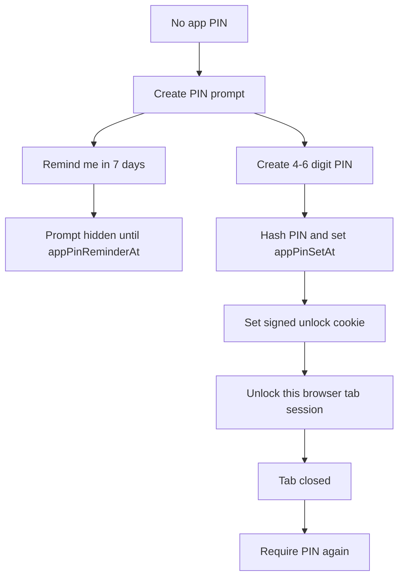

PIN behavior:

- PIN hash is stored on `User.appPinHash`.
- Unlock cookie is signed and tied to `appPinSetAt`.
- Browser tab unlock is also tracked in `sessionStorage`.
- Support/admin can reset a user PIN through the support workflow.
- Users can defer the PIN creation prompt for 7 days via `User.appPinReminderAt`.

## Support System

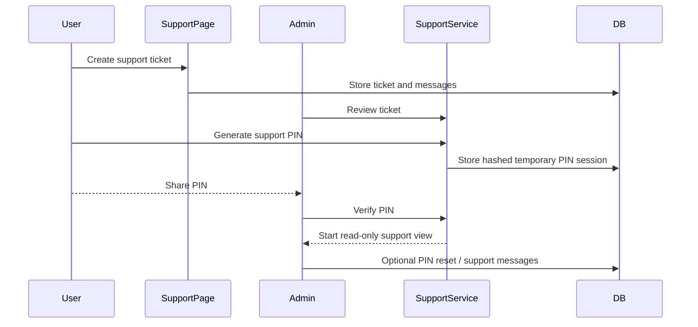

Support features:

- Ticket status, priority, category, and message thread.
- Support PIN with short expiry.
- Admin read-only support view.
- Audit trail through `SupportAccessAudit`.
- User can revoke active support PIN.

## Data Model Overview

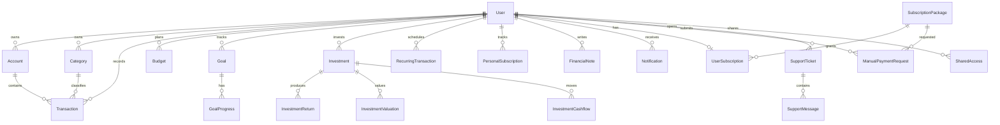

## Database Domains

| Domain | Models |
| --- | --- |
| Users and auth | `User`, `UserInvite`, `AccountDeletionRecord` |
| Subscription billing | `SubscriptionPackage`, `UserSubscription`, `ManualPaymentMethod`, `ManualPaymentRequest` |
| Sharing and permissions | `SharedAccess`, `FeatureAccess` |
| Core finance | `Account`, `Category`, `Transaction`, `Budget`, `RecurringTransaction` |
| Planning | `Goal`, `GoalProgress`, `SalaryScenario`, `TaxConfig` |
| Investments | `InvestmentTypeConfig`, `Investment`, `InvestmentReturn`, `InvestmentValuation`, `InvestmentCashflow`, `SanchayapatraConfig` |
| Personal services | `PersonalSubscription` |
| Notes | `FinancialNote` |
| Notifications | `Notification`, `NotificationPreference`, `AdminMessage`, `AdminMessageRecipient`, `AdminMessageState`, `BrowserPushSubscription` |
| Support | `SupportTicket`, `SupportMessage`, `SupportAccessSession`, `SupportAccessAudit` |
| Analytics | `PageView`, `UserActivity` |
| Academy | `Tutorial` |

## Admin Console

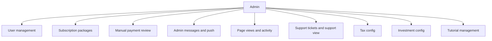

Admin capabilities:

- Create users and invitations.
- Manage subscription packages, including trial packages.
- Review, approve, reject, and audit manual payment requests.
- Configure admin messages with modal/banner/push-only delivery.
- Review analytics and activity.
- Handle support tickets and reset app PIN after verification.
- Configure tax slabs and investment/Sanchayapatra settings.
- Manage tutorial content.

## Route Map

### Public And Auth Routes

| Route | Purpose |
| --- | --- |
| `/` | Public entry or redirect surface |
| `/login` | Sign in |
| `/register` | Account registration |
| `/change-password` | Mandatory password change |
| `/recovery-backdoor` | Recovery-only route |
| `/onboarding` | First-login guided setup |

### User Routes

| Route | Purpose |
| --- | --- |
| `/dashboard` | Main dashboard |
| `/accounts` | Account management |
| `/transactions` | Transaction ledger |
| `/categories` | Category management |
| `/budgets` | Budget planning |
| `/goals` | Goal tracking |
| `/reports` | Reports and analytics |
| `/investments` | Investment dashboard |
| `/investments/portfolio` | Portfolio view |
| `/investments/types` | User investment type config |
| `/recurring` | Recurring transactions |
| `/service-tracker` | Personal subscription tracker |
| `/notes` | Financial notes |
| `/salary-planner` | Salary planner |
| `/tax-calculator` | Tax calculator |
| `/subscription` | Package selection and access status |
| `/subscription/payment` | Manual payment submission |
| `/support` | Support tickets |
| `/support/[id]` | Support ticket detail |
| `/tutorials` | User academy/tutorials |
| `/settings` | Account, preferences, billing, security, community |

### Admin Routes

| Route | Purpose |
| --- | --- |
| `/admin/analytics` | Analytics overview |
| `/admin/users` | User management |
| `/admin/subscriptions` | Package and subscription management |
| `/admin/payments` | Manual payment review |
| `/admin/messages` | Admin messages and browser push |
| `/admin/support` | Support queue |
| `/admin/investments` | Investment configuration |
| `/admin/tutorials` | Tutorial management |
| `/admin/tax-config` | Tax configuration |

## API And Background Routes

| Route | Purpose |
| --- | --- |
| `/api/auth/[...nextauth]` | NextAuth route handler |
| `/api/analytics/page-view` | Page-view tracking |
| `/api/analytics/activity` | User activity heartbeat |
| `/api/notifications/events` | Notification SSE stream |
| `/api/support/tickets/[id]/events` | Support ticket SSE stream |
| `/api/cron/notifications` | Notification detector trigger |
| `/api/cron/recurring` | Recurring transaction processor |
| `/api/cron/admin-message-push` | Admin message browser-push trigger |
| `/api/seed` | Demo seed endpoint |

## Core User Workflows

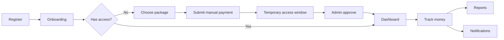

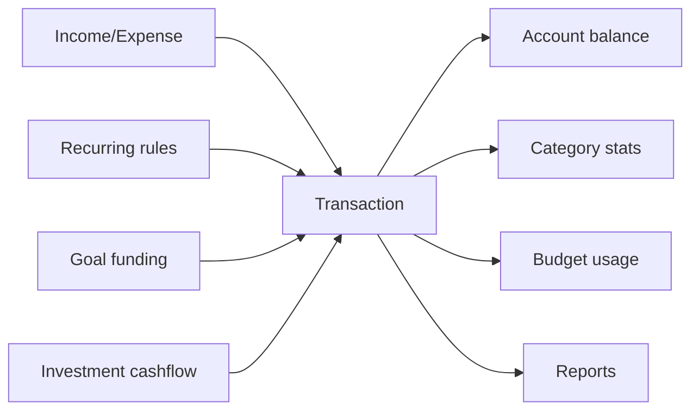

## Localization And Preferences

- Default locale: `bn-BD`.
- Supported locales: `bn-BD`, `en-US`.
- Default currency: `BDT`.
- Language can be changed in onboarding, topbar, and settings.
- Locale is stored in user profile and cookie.
- The first-login onboarding stepper updates its content immediately when the user selects Bangla or English.

## Security Notes

- Passwords and app PINs are hashed with bcrypt.
- Support PINs are temporary, hashed, and audited.
- App PIN unlock cookies are HMAC signed.
- Admin support access is read-only and session/audit based.
- Server actions re-check session and role/access before mutating data.
- Sensitive routes are protected in middleware/layout, not only hidden in the UI.

## Build And Operations

Common commands:

```bash
npm run dev
npm run build
npm run start
npx prisma validate
npx prisma generate
npx prisma migrate deploy
npm run seed:test
npm run seed:tax
npm run seed:tutorials
```

Operational notes:

- `npm run build` runs Prisma generate, migration deploy, and Next build.
- The app currently uses app-triggered recurring and notification processing rather than relying only on external cron.
- Browser push requires service worker registration and browser notification permission.
- Production DB drift should be handled with Prisma migrations and `prisma migrate deploy`.

## Suggested Reading Order For New Developers

1. `prisma/schema.prisma`
2. `src/lib/auth.config.ts`
3. `src/app/(dashboard)/layout.tsx`
4. `src/lib/subscription-access.ts`
5. `src/lib/access.ts`
6. `src/components/layout/Sidebar.tsx`
7. `src/actions/*` for write flows
8. `src/services/*` for domain logic
9. `src/i18n/messages/*` for user-facing copy

